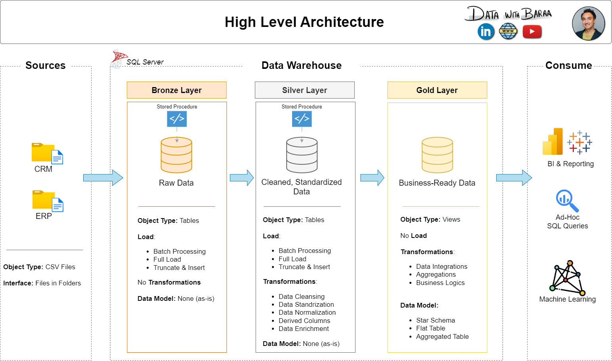

# Data Warehouse and Analytics Project

Welcome to the **Data Warehouse and Analytics Project** repository! 🚀  
This project demonstrates a comprehensive data warehousing and analytics solution, from building a data warehouse to generating actionable insights. Designed as a portfolio project, it highlights industry best practices in data engineering and analytics.

---

## 🏗️ Data Architecture

The data architecture for this project follows the Medallion Architecture, consisting of **Bronze**, **Silver**, and **Gold** layers:



1. **Bronze Layer**: Stores raw data from source systems as-is. Data is ingested from CSV files into a SQL Server database.
2. **Silver Layer**: Includes data cleansing, standardization, and normalization to prepare data for analysis.
3. **Gold Layer**: Contains business-ready data modeled into a star schema for reporting and analytics.

---

## 📖 Project Overview

This project involves:

1. **Data Architecture**: Designing a modern data warehouse using Medallion Architecture (**Bronze**, **Silver**, and **Gold** layers).
2. **ETL Pipelines**: Extracting, transforming, and loading data from source systems into the warehouse.
3. **Data Modeling**: Developing fact and dimension tables optimized for analytical queries.
4. **Analytics & Reporting**: Creating SQL-based reports and dashboards for actionable insights.

🎯 This repository is an excellent resource for professionals and students looking to showcase expertise in:
- SQL Development
- Data Architecture
- Data Engineering
- ETL Pipeline Development
- Data Modeling
- Data Analytics

---

## 🛠️ Important Links & Tools

All tools and resources in this project are free to use!

- **[Datasets](datasets/)**: Access the project dataset (CSV files).
- **[SQL Server Express](https://www.microsoft.com/en-us/sql-server/sql-server-downloads)**: Lightweight server for hosting your SQL database.
- **[SQL Server Management Studio (SSMS)](https://learn.microsoft.com/en-us/sql/ssms/download-sql-server-management-studio-ssms?view=sql-server-ver16)**: GUI for managing and interacting with databases.
- **[GitHub](https://github.com/)**: Set up a GitHub account and repository to manage, version, and collaborate on your code.
- **[Draw.io](https://www.drawio.com/)**: Design data architecture, models, flows, and diagrams.
- **[Notion Project Template](https://www.notion.com/templates/sql-data-warehouse-project)**: Access the project template.
- **[Notion Project Steps](https://thankful-pangolin-2ca.notion.site/SQL-Data-Warehouse-Project-16ed041640ef80489667cfe2f380b269?pvs=4)**: Access all project phases and tasks.

---

## 🚀 Project Requirements

### Building the Data Warehouse (Data Engineering)

#### Objective:
Develop a modern data warehouse using SQL Server to consolidate sales data, enabling analytical reporting and informed decision-making.

#### Specifications:
- **Data Sources**: Import data from two source systems (ERP and CRM) provided as CSV files.
- **Data Quality**: Cleanse and resolve data quality issues prior to analysis.
- **Integration**: Combine both sources into a single, user-friendly data model designed for analytical queries.
- **Scope**: Focus on the latest dataset only; historization of data is not required.
- **Documentation**: Provide clear documentation of the data model for business stakeholders and analytics teams.

### BI: Analytics & Reporting (Data Analysis)

#### Objective:
Develop SQL-based analytics to deliver detailed insights into:
- **Customer Behavior**
- **Product Performance**
- **Sales Trends**

These insights will empower stakeholders with key business metrics for strategic decision-making.

For more details, refer to [docs/requirements.md](docs/requirements.md).

---

## 📂 Repository Structure

```plaintext
data-warehouse-project/
│
├── datasets/               # Raw datasets (ERP and CRM data)
├── docs/                   # Project documentation and architecture details
├── etl.drawio              # Draw.io file for ETL techniques and methods
├── data_architecture.drawio# Data architecture diagram
├── data_catalog.md         # Catalog of datasets, including field descriptions and metadata
├── data_flow.drawio        # Data flow diagram
├── data_models.drawio      # Star schema data models
├── naming-conventions.md   # Naming conventions for tables, columns, and files
├── scripts/                # SQL scripts for ETL and transformations
│   ├── bronze/             # Scripts for extracting and loading raw data
│   ├── silver/             # Scripts for cleaning and transforming data
│   ├── gold/              # Scripts for creating analytical models
├── tests/                  # Test scripts and quality files
├── README.md               # Project overview and instructions
└── requirements.txt        # Dependencies and requirements
